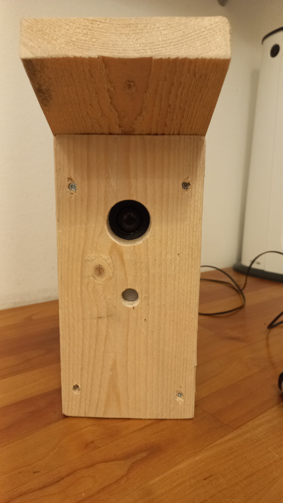
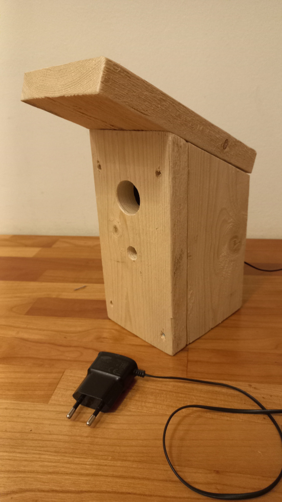
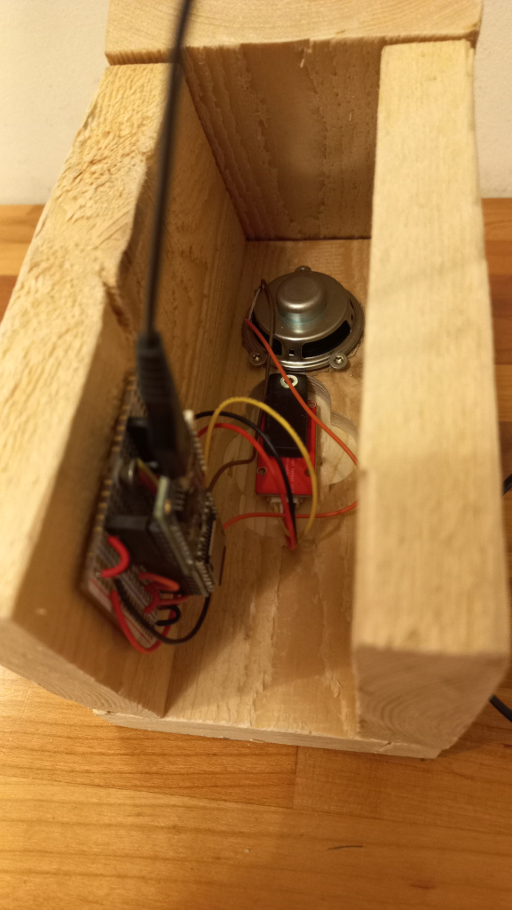
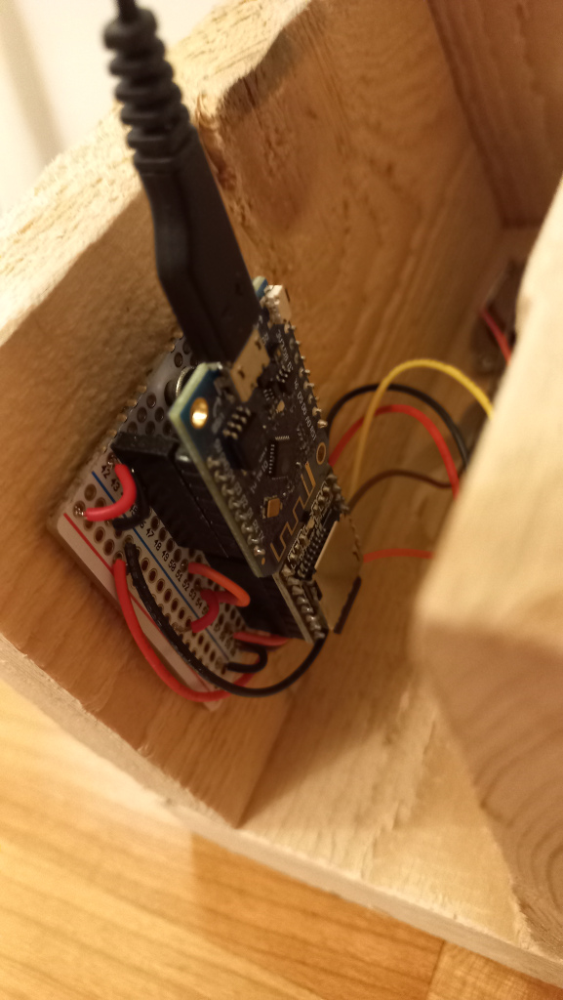

# birdhouse-esp8266

Birdhouse with
 * ESP 8266 Wemos D1
 * [DFPlayer](https://wiki.dfrobot.com/DFPlayer_Mini_SKU_DFR0299)
 * [Crowtail PIR sensor](https://www.elecrow.com/wiki/index.php?title=Crowtail-_PIR_Motion_Sensor)

When PIR detects movement it plays a random bird audio clip with random volume.

# Images

Front: spearker in the upper hole, PIR in the lower:\

Powered with micro-USB charger connected directly to Wemos D1:\

Back side is left open in order to reach the microSD card and other components:\

Microcontroller and DFPlayer:\

# Preparing the microSD card

 1. Create a FAT-formatted partition (i.e. a "regular Windows formatted drive")
 1. Create a directory `mp3` under the root
 1. Place the audio clips (bird voices) to the `mp3` directory. The file names must begin with four digits like this:
    * `mp3/0001kingfisher.mp3`
    * `mp3/0002pipit.mp3`
    * `mp3/0003hawkowl.mp3`
    * ...
    * `mp3/0010alpinethrush.mp3`
    * `mp3/0011asianbarredowlet.mp3`
